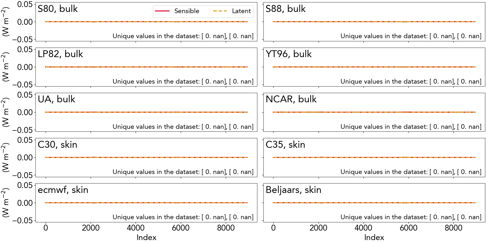

# Air-Sea Flux Analysis: Impact of Reference Height

In air-sea flux analysis, the selection of reference heights for correcting air temperature, humidity, and wind speed might influence the computed heat fluxes. Conventionally, air temperature and humidity are corrected to a 2m reference height, while wind speed is often corrected to a 10m reference height. This raises the question: does changing the output height in the code impact specific or latent heat flux outputs?

## Methodology

To investigate the impact of varying reference heights, we performed air-sea flux analysis using different output heights. Specifically, we considered two heights: 2m and 10m, and subdsequently analyze the resulting heat fluxes.

## Results

The figure below illustrates the variations in specific and latent heat flux outputs corresponding to different output heights.

The colored lines depict the differences in sensible and latent heat fluxes between the 10m and 2m output heights. As is clear in the figure, there is **no** difference between 10 or 2 m, regardless of choice of methods.